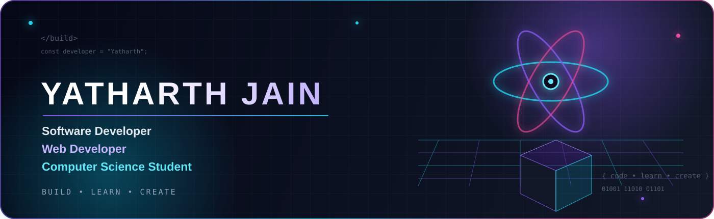

<div align="center">



# ⚡ YATHARTH JAIN

### Software Developer · Web Developer · Computer Science Student

**Building practical software • Exploring intelligent systems • Learning by creating**


<a href="https://github.com/yatharthg1727-ctrl"></a>
<a href="https://www.linkedin.com/in/yatharthjain1234879/"></a>

</div>

---

## 🖥️ Developer System

| SYSTEM | CURRENT STATE |
|---|---|
| 👤 Name | Yatharth Jain |
| 💻 Role | Software Developer |
| 🎓 Background | Computer Science Student |
| 🌐 Focus | Web Development |
| 🤖 Exploring | AI & Intelligent Systems |
| 📊 Exploring | Data Analytics |
| ⚙️ Engineering | Software Development |
| 🧠 Learning Style | Project-Based |
| 🚀 Status | Continuously Building |

> I learn by building real projects, understanding systems, debugging problems and improving implementations.

---

## ⚡ What I Build

`Web Development` · `Python` · `AI & Intelligent Systems` · `Data & Analytics` · `Software Engineering` · `Real-World Systems`

---

# 🧰 Technology Core

### 💻 Programming

  

### 🌐 Web & Apps

     

### 🗄️ Databases

  

### 📊 Data

  

### 🛠️ Tools

  

---

# 🧬 Engineering Map

```text
                         SOFTWARE ENGINEERING
                                  │
              ┌───────────────────┼───────────────────┐
              ▼                   ▼                   ▼
             WEB                 DATA                 AI
              │                   │                   │
        React • Node        Pandas • NumPy       Intelligent
        HTML • CSS           Matplotlib            Systems
              └───────────────────┼───────────────────┘
                                  ▼
                              PROJECTS
                 ┌────────────────┼────────────────┐
                 ▼                ▼                ▼
            Emergency        Civic/Data       Education/
             Systems          Systems         Navigation
```

---

# 🚀 Project Universe

## 01 · 🚨 Raksha Setu
**Intelligent Road Accident Detection & Emergency Response Platform**

Accident detection, emergency response, risk assessment and location intelligence.

`React` · `TypeScript` · `Supabase` · `Maps` · `Risk Engine`

<a href="https://raksha-setu-emergency-platform--yatharthj7711.replit.app/overview"></a>

## 02 · 🌆 CityPulse
**Live Civic Intelligence Dashboard**

Real-time civic monitoring, anomaly detection and multi-signal analysis.

`Traffic` · `Weather` · `Transit` · `Complaints` · `Incidents` · `Environment`

```text
Weather → Traffic → Transit → Complaints → Multi-Signal Analysis → Civic Intelligence
```

<a href="https://married-graduate-guam-rpg.trycloudflare.com/login"></a>

## 03 · 🧊 VaxSafe AI
**Vaccine Cold-Chain Monitoring System**

Telemetry, temperature monitoring, potency tracking and intelligent alerts.

`Python` · `Flask` · `IoT` · `AI` · `Three.js` · `Chart.js`

```text
-2°C ─────────────────────────── +8°C
             SAFE RANGE
```

## 04 · 🎓 Student Academic Performance Analyzer
**Academic Management & Performance Analysis**

Student information, marks, attendance, grades, reports and database management.

`Python` · `Flask` · `SQLite` · `HTML` · `CSS`

<a href="https://github.com/yatharthg1727-ctrl/Student-Academic-Performance-Analyzer"></a>

## 05 · 🛸 Drone Navigation
**Intelligent Drone Navigation Concept**

Navigation, path planning, autonomous systems and real-world applications.

`Project concept — technical implementation evolving.`

---

# 📊 GitHub Command Center

<div align="center">


<br>


</div>

---

# 📈 Live GitHub Activity Graph

<div align="center">

</div>

> The graph reflects GitHub activity and refreshes according to the graph service's update cycle.

---

# 🐍 Contribution Snake Game

## 🟩 Real GitHub contributions become the snake's game board.

<div align="center">
<picture>
<source media="(prefers-color-scheme: dark)" srcset="https://raw.githubusercontent.com/yatharthg1727-ctrl/yatharthg1727-ctrl/output/github-contribution-grid-snake-dark.svg">
<source media="(prefers-color-scheme: light)" srcset="https://raw.githubusercontent.com/yatharthg1727-ctrl/yatharthg1727-ctrl/output/github-contribution-grid-snake.svg">

</picture>
</div>

### 🎮 How it works

```text
GITHUB ACTIVITY
      │
      ▼
CONTRIBUTION GRID
      │
      ▼
 🟩 🟨 🟧 🟥
      │
      ▼
    🐍 SNAKE
      │
      ▼
EATS CONTRIBUTION CELLS
```

### 🔄 Automatic Pipeline

```text
GitHub Contributions
        ↓
GitHub Actions
        ↓
Platane/Snk
        ↓
Animated SVG
        ↓
output branch
        ↓
Profile README
        ↺
Automatic regeneration
```

> The snake is generated from the real contribution calendar. It does not invent contribution numbers. New contributions appear when GitHub and the workflow data refresh.

---

# 🔄 Live Profile Architecture

```text
                    GITHUB ACTIVITY
                           │
          ┌────────────────┼────────────────┐
          ▼                ▼                ▼
        STATS          ACTIVITY GRAPH      STREAK
          │                │                │
          └────────────────┼────────────────┘
                           ▼
                  CONTRIBUTION CALENDAR
                           │
                           ▼
                      🐍 SNAKE
                           │
                           ▼
                    ANIMATED SVG
                           │
                           ▼
                    PROFILE README
```

---

# 🎯 Current Focus

```text
🌐 Advanced Web Development
🧠 Data Structures & Algorithms
🤖 Artificial Intelligence
📚 Machine Learning
📊 Data Analytics
⚙️ Software Engineering
🚀 Real-World Applications
```

---

# ⚙️ How I Build

```text
IDEA → PLAN → BUILD → TEST → DEBUG → IMPROVE → SHIP → LEARN ↺
```

## 🧠 Engineering Mindset

### Build → Break → Understand → Improve

I learn best by building, understanding why systems work, debugging failures and improving practical implementations.

---

# 🧪 Learning & Experiments

## 🐍 Python 100 Programs

Python learning repository covering programming fundamentals, OOP, file handling, exception handling and data libraries.

<a href="https://github.com/yatharthg1727-ctrl/Python_100_Programs"></a>

---

# 📚 Computer Science Roadmap

```text
COMPUTER SCIENCE
│
├── 💻 Programming → C++ · Python · Java
├── 🧠 Data Structures → Arrays · Linked Lists · Stacks · Queues · Algorithms
├── ⚙️ Software Engineering → OOP · Databases · APIs · Architecture
└── 🤖 Intelligent Systems → AI · ML · Data · Automation
```

---

# 🌐 Developer Workflow

| STAGE | APPROACH |
|---|---|
| 💡 Idea | Identify a real problem |
| 🧩 Plan | Break the problem into smaller systems |
| 💻 Build | Implement the core functionality |
| 🧪 Test | Check real use cases |
| 🐛 Debug | Understand and fix failures |
| 🔧 Improve | Refine the system |
| 🚀 Deploy | Make the project usable |
| 📖 Learn | Document what worked and what didn't |

---

# 🏗️ Project Philosophy

```text
REAL PROBLEM → PRACTICAL IDEA → SYSTEM DESIGN → WORKING SOFTWARE
                                      ↓
                              TEST → DEBUG → IMPROVE
                                      ↓
                                REAL-WORLD USE
```

---

# 🔗 Connect

<div align="center">
<a href="https://github.com/yatharthg1727-ctrl"></a>
<a href="https://www.linkedin.com/in/yatharthjain1234879/"></a>

<br><br>

# ⚡ ALWAYS BUILDING

`CODE` • `LEARN` • `CREATE` • `DEBUG` • `IMPROVE`

<br>

</div>
